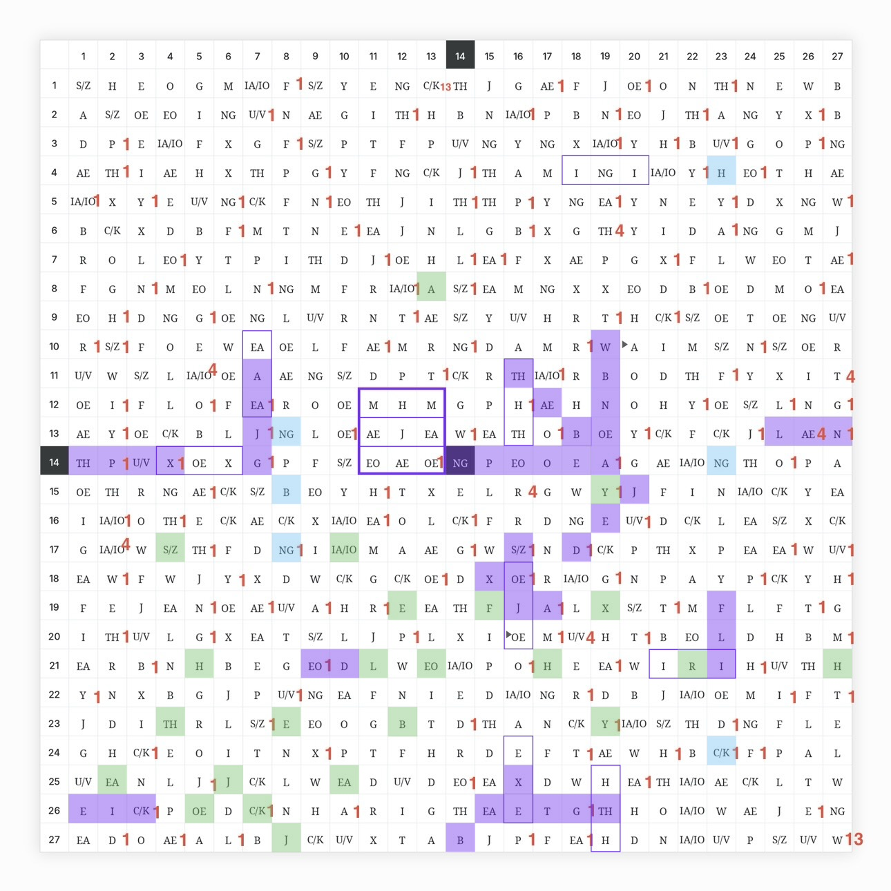

<sub>✨ Sep 13, 2026 · **Volume 5**</sub>

<kbd>1</kbd>&nbsp;&nbsp;AS I GO, THE WEATHER TURNS COLD.  
<kbd>2</kbd>&nbsp;&nbsp;I MAY CRY NOW.  
<kbd>3</kbd>&nbsp;&nbsp;THE IDEA OF THE END IS DEATH.

<p align="center">
  
</p>

🟪 **Purple** — plaintext route  
🟦 **Blue** — hidden-key locations  
🟩 **Green** — navigation clues


#### 💡 See how the plaintext was found

Click below to start reading from Volume 1, then continue with the next volumes.

**[Open the markdown archive](./Read-here/)**


#### 💯 A numerical fingerprint

These numerical coincidences strongly support the idea that this may be a real solution to Liber Primus 0–2, rather than an arbitrary plaintext produced by chance.

```text
AS I GO, THE WEATHER TURNS COLD.
```

**7 words** · **21 runes** · **GP sum = 233**

```text
7 words
↓
21 plaintext runes = 3 × 7
↓
Sum of the 0-based Gematria Primus indices
of all 21 plaintext runes = 233
↓
COLD: sum of the 0-based GP indices = 51
↓
233 is the 51st prime

TURNS ends on W in column 19
COLD begins in column 7

W has:
0-based GP index = 7
prime value = 19

W is the only rune where:
19 − 7 = 12 = φ(NG)

So the same 19 → 7 relation appears twice:
numerically inside W
and geometrically in the route from TURNS to COLD

NG = GP index 21
NG = center of the 27×27 matrix

13 is the 7th Fibonacci number
233 is the 13th Fibonacci number

7 → F₇ = 13 → F₁₃ = 233
```

These connections tie together the plaintext length, its Gematria Primus values, the word COLD, the route through the grid, the central NG rune, and the Fibonacci pattern. Since all of them point back to the same recovered sentence, the result is difficult to explain as an arbitrary coincidence.

#### Volume 5 reveals a new numerical relation in the plaintext.

The newly recovered 7-word block

> **THE IDEA OF THE END IS DEATH.**

has a 0-based Gematria Primus sum of:

> **232**

The preceding 7-word block

> **AS I GO, THE WEATHER TURNS COLD.**

has a sum of:

> **233**

Since 233 is prime:

> **φ(233) = 232**

This gives the exact Volume 5 transition:

> **233 → φ(233) → 232**

The newly recovered 7-word block is therefore the Euler totient of the preceding one.
