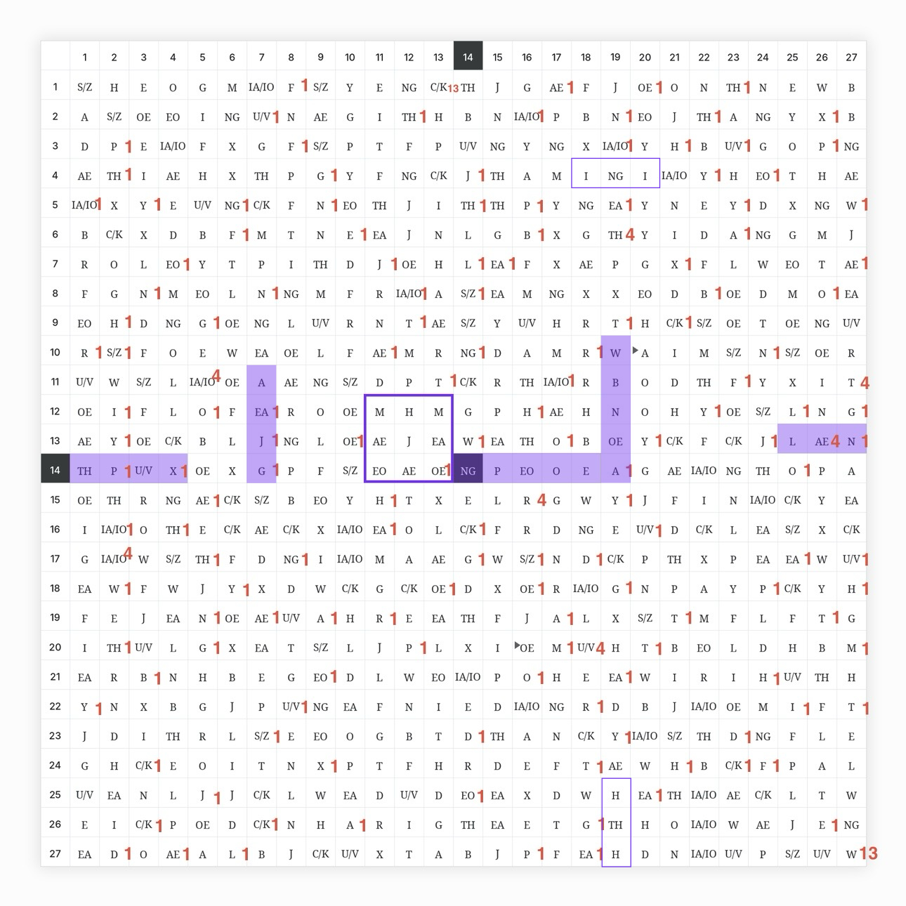

<div align="center">

### ✨ Plaintext recovered so far

<h2>
AS I GO, THE WEATHER TURNS COLD.<br>
I MAY CRY NOW. THE ...
</h2>

<sub>from the current Liber Primus 0–2 · 27×27 model</sub>

</div>

---

## 🗺️ The map

<p align="center">
  
</p>

🟪 **Purple** — ciphertext that becomes plaintext  
🟦 **Blue** — hidden-key points  
🟩 **Green** — geometric clues and transitions  
🟣 **Purple outline** — mirror structures directly involved in the route

---

## 📚 Read the full research

This README is only a short overview.

The PDFs are the best place to follow the actual solution route: they show the **highlighted matrix, coordinates, keys, movements, calculations, and reasoning** step by step.

### **[📖 Open the PDF archive →](./Read-PDFs-Here/)**

*Volumes 1–3 · complete visual walkthrough*

---

## 🧭 What is the idea?

The model starts from one simple observation:

> **729 runes = 27 × 27**

So the runes from Liber Primus pages 0–2 can be placed, in their original order, into a perfect **27×27 grid**.

The grid is then treated as two things at once:

**ciphertext** + **map**

The route repeatedly follows the same general pattern:

```text
🪞 find a structure
      ↓
🔑 get a key or useful number
      ↓
🧭 move through the grid
      ↓
🔓 decrypt
      ↓
✨ reach plaintext
      ↓
➡️ continue from that point
```

The important part is that one stage often leads directly into the next.

---

## 🪞 Mirrors

A recurring structure looks like this:

```text
A — B — A
```

These three-rune mirrors often appear at important points of the route.

The center rune can be transformed with **Euler's totient function φ**:

```text
A — B — A
      ↓
    φ(B)
```

That result can become a **key**, a **number used for movement**, or a clue to another structure.

---

## 🔑 Keys and movement

Some keys are generated directly from the mirror currently being used:

```text
mirror → transform center → key
```

Other keys are found elsewhere in the matrix.

In those cases, values discovered earlier can be reused as distances:

```text
earlier value → move → hidden key
```

So the numbers are not always used once and forgotten.

A value can return later as a distance, a matching signature, or even the radius of another mirror.

---

## 🧮 Key phase

A three-rune key can start in three cyclic positions.

The current model uses the Möbius function to choose that phase before looking at the plaintext:

```text
p = Σ μ(φ(Kᵢ)) mod 3
```

Once the phase is fixed, the actual decryption is simple:

```text
P = C − K mod 29
```

using zero-based Gematria Primus values.

---

## 🔁 Why the route is interesting

The recovered text does not appear as isolated words.

The end of one stage often lands on or points toward another meaningful structure.

So the model behaves more like:

```text
structure → key → movement → plaintext → next structure
```

That is the main idea behind the current **27×27 geometric route**.

---

## ✨ Progress

**📘 Volume 1**  
Introduces the 27×27 map, mirrored nodes, φ, Möbius phase, and mod-29 decryption.

> **AS I GO, THE WEATHER TURNS COLD.**

**📗 Volume 2**  
Adds hidden keys and the reuse of earlier totient values.

> **I MAY CRY...**

**📙 Volume 3**  
Develops mirror geometry as a direction clue and continues the route.

> **NOW THE**

---

## 🧪 Check the mechanics

For anyone who wants to reproduce the documented steps:

- 🧱 **[Raw 0–2 runes](./other-stuff/0-2-runes.txt)**
- 🗺️ **[27×27 matrix](./liber-primus-27x27-matrix.png)**
- ✅ **[Volume 1 verifier](./verify_volume_1.py)**
- ✅ **[Volume 2 verifier](./verify_volume_2.py)**

The verifier scripts check the documented coordinates, transformations, phases, and mod-29 arithmetic.

*They verify internal reproducibility of the proposed route, not an official Cicada 3301 solution.*

---

## 🜏 What is Liber Primus?

If you are new to the puzzle, start here:

### **[🜏 Read: What is Liber Primus? →](./WHAT-IS-LIBER-PRIMUS.md)**

A short introduction to Liber Primus and the idea behind this 27×27 approach.

---

## 🤖 Using AI?

For AI analysis, exact coordinates, searchable formulas, and machine-readable reasoning:

### **[🤖 Open the technical Markdown archive →](./other-stuff/md/)**

*Volumes 1–3 · searchable technical versions*

---

<div align="center">

<sub>Independent ongoing research · current model · not officially verified</sub>

</div>
