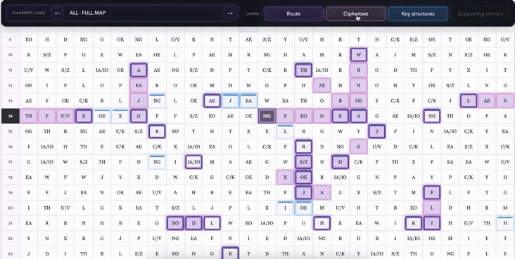

<!-- AUTO-PLAINTEXT:START -->

  

<!-- AUTO-PLAINTEXT:END -->

Click to see how I found the plaintext.

---

  

Click to see my 27×27 map.

---
### About

This project presents a potentially groundbreaking discovery in the search for the true solution to Liber Primus. I believe the plaintext found within the 27×27 matrix may be genuine. You can explore how each part of the plaintext was found in the [plaintext-i-found](./plaintext-i-found/) folder, follow the entire process on my [interactive map](https://2retooz270703.github.io/Liber-Primus-27x27-Map-3-Rune-Nodes-Totient-Decryption/), learn about the methods I used in the [rules](./rules/) folder, and examine the strongest supporting evidence in [strongest-plaintext-evidence.md](./strongest-plaintext-evidence.md).
