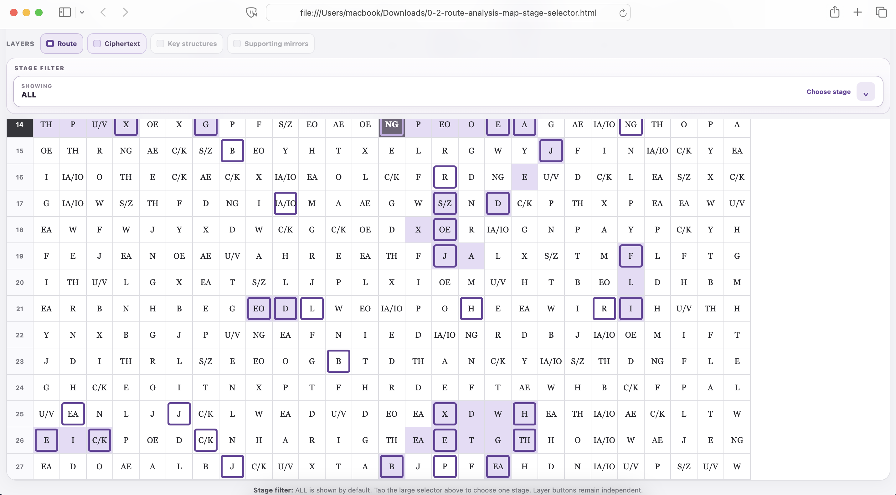

⚡️ Last updated: **4 October 2026**

## Live Route Analysis

### [Open the Live Route Map →](https://2retooz270703.github.io/Liber-Primus-27x27-Map-3-Rune-Nodes-Totient-Decryption/)

  

The map allows you to explore the full route or focus on individual stages 01–15, including the related ciphertext, key structures, and supporting geometry. It will be updated as the reconstruction develops and new stages or structural findings are added.

---

## Recovered Plaintext

STAGES 01–15

  

**AS I GO, THE WEATHER TURNS COLD.**  
**I MAY CRY NOW.**  
**THE IDEA OF THE END IS DEATH.**  
**SEE YOU SOON**

  

Current endpoint — <strong>SOON</strong>

